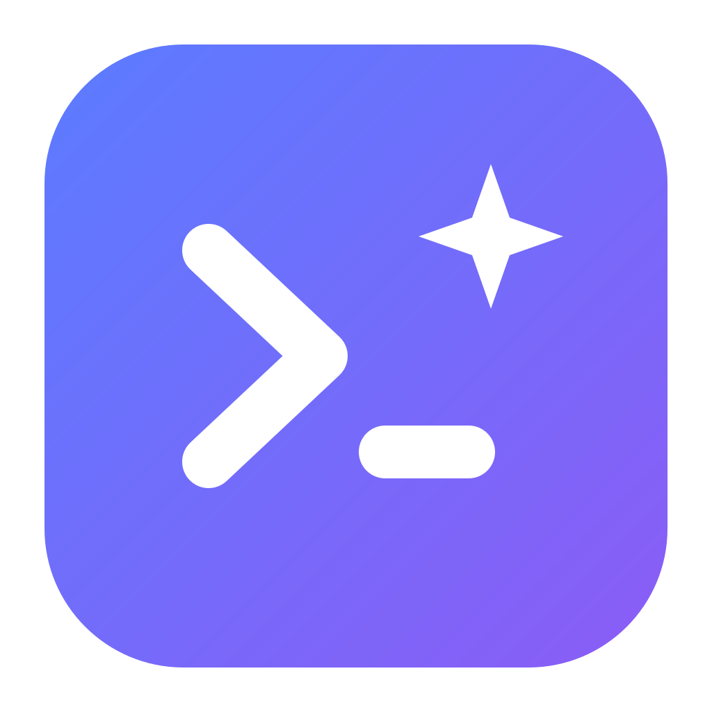

<p align="center">
  
</p>

<h1 align="center">Aime - AI Mini Editor</h1>

<p align="center">
  A lightweight desktop code editor with AI agents at its core.<br/>
  Powered by headless AI CLIs - Claude Code today, Codex and any CLI you configure next.
</p>

---

## Why Aime?

AI CLIs (Claude Code, Codex CLI, …) are already complete coding agents: they read and edit files,
run commands, and manage sessions. Aime doesn't rebuild the agent - it is a **thin, fast, beautiful
editor layer** on top of them:

- ⚡ **Genuinely light** - Tauri 2, ~10 MB installer, sub-second startup
- 🤖 **AI panel as the main character** - character-level streaming, tool calls as chips, transparent token costs
- 🧠 **Never loses track** - sessions persist per project and resume with full context after a restart; the agent keeps a `.aime/PROGRESS.md` journal so long tasks survive anything
- 🎛️ **Full control** - model picker (latest aliases + pinned versions), reasoning effort, auto-approve toggle, per-session usage breakdown
- 🖥️ **Integrated terminal** - PowerShell tabs on ConPTY, theme-aware (Ctrl+`)
- 🗂️ **Real workspace** - live file watcher, drag & drop moves, recent folders, `aime .` launcher
- 🪟 **Multi-window** - one window per project, work on 2-3 projects side by side (Ctrl+Shift+N)
- 🌍 **Multilingual UI** - English by default, Vietnamese included; searchable in-app help (F1)
- 🔌 **Open adapters** - every CLI goes through a thin adapter that normalizes its events; the UI never knows which vendor is behind it
- ✍️ **Still a real editor without AI** - the file tree, Monaco editor, and terminal work standalone

## Tech stack

| Layer  | Technology                              |
| ------ | --------------------------------------- |
| Shell  | Tauri 2 (Rust)                          |
| UI     | React 19 + TypeScript + Tailwind CSS 4  |
| Editor | Monaco (bundled locally, fully offline) |
| State  | zustand                                 |

Every AI CLI is reached through an adapter that normalizes its output into one event set, so the UI
never knows which CLI answers: `src-tauri/src/providers/adapter.rs` is the whole contract.

## Development

Requirements: Node ≥ 20, Rust (stable; MSVC on Windows). For the AI features, install one of the
supported CLIs - [Claude Code](https://code.claude.com) (`npm install -g @anthropic-ai/claude-code`)
or [Codex](https://github.com/openai/codex) (`npm install -g @openai/codex`) - and sign in from
inside Aime with the key button in the AI panel. Without any of them Aime still works as a plain
editor, with Git, terminal and tasks.

```bash
npm install
npm run tauri dev      # run the app (first Rust build takes a while)
npm run tauri build    # package installers
npm run check          # prettier + eslint (strict) + tsc - must pass before committing
npm test               # frontend unit tests (vitest)
cd src-tauri && cargo test   # Rust unit tests
npm run test:e2e             # drives the real window (see e2e/README.md)
```

Code standards are enforced by a pre-commit hook (prettier, eslint, rustfmt). Enable it once after cloning:

```bash
git config core.hooksPath .githooks
```

## Releases

Tagging `v*` builds installers for Windows, macOS and Linux in CI and opens a
draft release; publishing it is a human decision. The same job signs
`latest.json`, which the app checks once per launch - a new version appears as
a bar at the top of the window, and nothing downloads until the user says so.

Two channels, told apart by the tag:

| Tag             | Published as                              | Who sees it                           |
| --------------- | ----------------------------------------- | ------------------------------------- |
| `v0.2.0`        | a normal release                          | everyone                              |
| `v0.2.0-beta.1` | a pre-release under the moving `beta` tag | only installs set to Beta in Settings |

Update signing needs two repository secrets: `TAURI_SIGNING_PRIVATE_KEY` and
`TAURI_SIGNING_PRIVATE_KEY_PASSWORD`. Keep a backup of the private key: without
it, no future build can update an existing install.

Signing the installers themselves is separate, optional, and costs money -
an Authenticode certificate on Windows, a Developer ID on macOS. The workflow
passes `WINDOWS_CERTIFICATE`, `APPLE_CERTIFICATE` and friends through when they
exist; without them the installers still work, the operating system just warns
before the first run.
